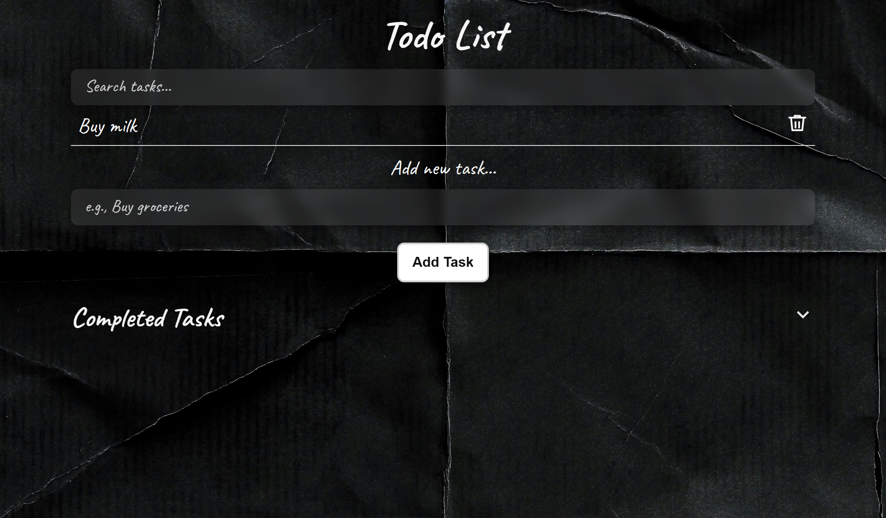

# Aesthetic To-Do List Web App ✨

This is a beautifully styled To-Do List application designed with a black scrapbook aesthetic. It allows users to:

- Add new tasks
- Mark tasks as completed
- Toggle visibility of completed tasks
- Delete tasks
- Search through tasks in real-time

## Features

- [x] Sleek torn paper background
- [x] Elegant handwriting fonts for a creative vibe
- [x] Dynamic task creation and completion
- [x] Real-time search filtering
- [x] Expand/collapse completed tasks
- [x] Responsive design for mobile and desktop

## Technologies Used

- HTML5
- CSS3
- JavaScript (Vanilla)

## Screenshots

  

## Setup

1. Clone this repository:
   `bash
   git clone https://github.com/foidevans/todo-list.git

## Credits
- Made with love and creativity by Favour Evans